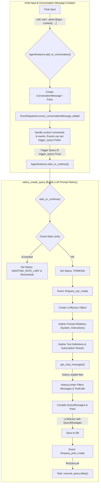

```mermaid
graph TD
    subgraph "Chat Input & Conversation Message Creation"
        A["Chat Input"] -- "role:'user', parts=[{type, content}, ...]" --> B{"AgentInstance.add_to_conversation()"};
        B --> C["Create ConversationMessage / Parts"];
        C --> D["EventDispatcher.event_conversationMessage_added"];
        D --> E["Handle custom commands & events. Events can set trigger_query=False."];
        E -- "Trigger Query (if trigger_query=True)" --> G["AgentInstance.start_or_continue()"];
    end

    subgraph "celery_create_query (Builds LLM Prompt History)"
        direction TB
        G --> H_START{"start_or_continue()"};
        H_START --> I{"Check Rate Limits"};
        I -- "Exceeded" --> J["Set Status: AWAITING_RATE_LIMIT & Reschedule"];
        I -- "OK" --> K["Set Status: THINKING"];
        K --> L["Event: llmquery_pre_create"];
        L --> M["Create LLMQuery Object"];
        M --> N["Gather Prompt Relations (System, Instructions)"];
        N --> O["Gather Tool Definitions & Subscription Results"];
        O --> P["get_chat_messages()"];
        P -- "history, loaded files" --> Q["HistoryLimiter Filters Messages & ToolCalls"];
        Q --> R["Compile QueryMessages & Parts"];
        R -- "LLMQuery with QueryMessages" --> S["Save to DB"];
        S --> T["Event: llmquery_post_create"];
        T -- "llmQuery.pk" --> U["Task: execute_query.delay()"];
    end
```