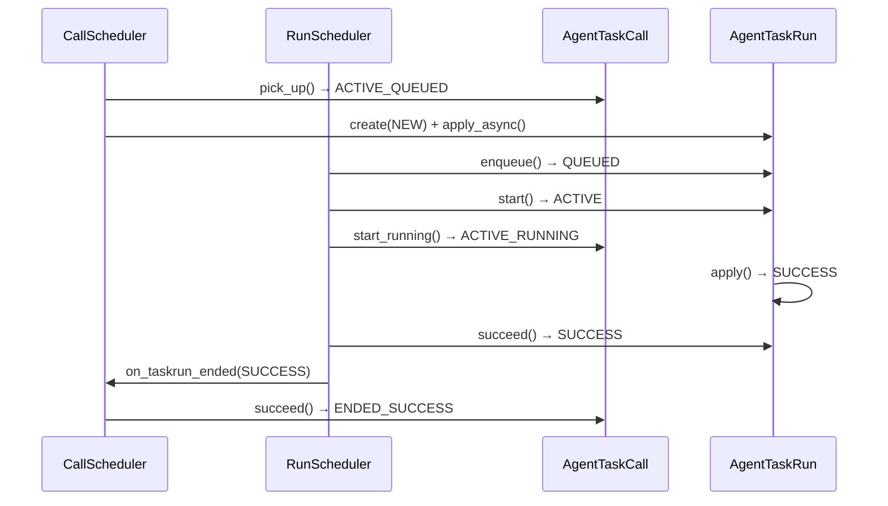
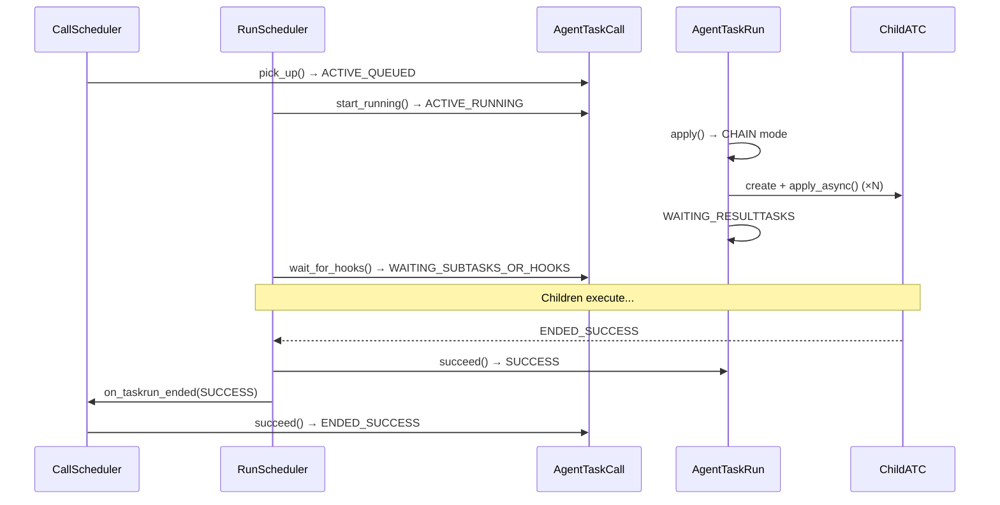
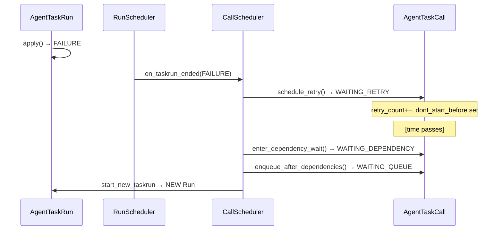
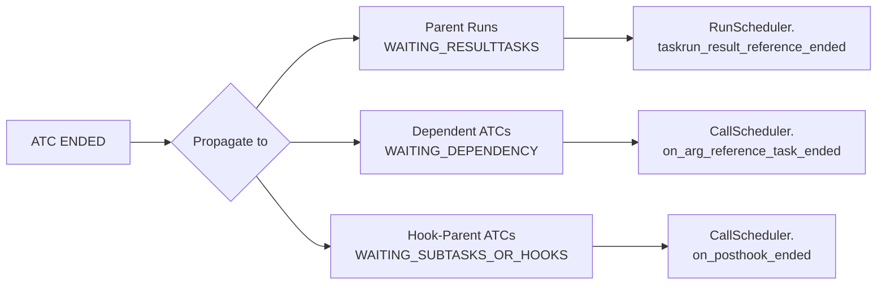

# Paired ATC-Run Lifecycle

The `AgentTaskCall` (ATC) and `AgentTaskRun` (Run) are updated together at key points. Race conditions are handled via atomic `WHERE status=X` updates.

## 1. Run Start (Worker Picks Up)

**Code:** `RunScheduler._apply_async(run_id)` (`run_scheduler.py:22-42`)

```
1. run_fsm.start(run_id)                # QUEUED → ACTIVE
2. call_fsm.start_running(call_id)       # ACTIVE_QUEUED → ACTIVE_RUNNING
3. If step 2 fails:
     run_fsm.rollback_to_queued(run_id)  # ACTIVE → QUEUED
```

**Race condition:** Two workers receive the same Celery message. Worker A starts the run (`QUEUED → ACTIVE`). Worker B's `start()` returns False (run already ACTIVE). Worker B exits. Worker A proceeds to `start_running()`. If another process already transitioned the ATC out of `ACTIVE_QUEUED`, Worker A rolls back the run to `QUEUED`.

## 2. Run Completes (Positive, No Result Refs)

**Code:** `RunScheduler._apply_async()` → `apply()` → `run_scheduler.py:71-72`

```
1. apply() returns normally, no ref_pks
2. run_fsm.succeed(run_id)              # ACTIVE → SUCCESS
3. CallScheduler.on_taskrun_ended():
   a. No after-hooks:
      call_fsm.succeed(call_id)          # ACTIVE_RUNNING → ENDED_SUCCESS
   b. Has after-hooks:
      call_fsm.wait_for_hooks(call_id)   # ACTIVE_RUNNING → WAITING_SUBTASKS_OR_HOOKS
```

## 3. Run Completes (With Result Refs / CHAIN)

**Code:** `run_scheduler.py:54-66`

```
1. apply() returns WAITING_RESULTTASKS (ref_pks non-empty)
2. Check pending refs:
   a. Refs still pending:
      call_fsm.wait_for_hooks()           # ACTIVE_RUNNING → WAITING_SUBTASKS_OR_HOOKS
   b. No refs pending (all already ended):
      all_taskrun_result_references_ended()
```

## 4. Run Fails (No Retries)

**Code:** `call_scheduler.on_taskrun_ended()` (`call_scheduler.py:275-282`)

```
1. apply() raises exception → FAILURE
2. call_fsm.schedule_retry():
   a. Retries remain → WAITING_RETRY (return)
   b. No retries left → call_fsm.fail()  # ACTIVE_RUNNING → ENDED_FAILURE_EXCEPTION
```

## 5. Run Hits Rate Limit

**Code:** `run_scheduler.py:46-52`

```
1. apply() catches RateLimitError → RATE_LIMITED (raw set, bypasses FSM)
2. call_fsm.rate_limit(call_id)          # ACTIVE_RUNNING → WAITING_RATELIMIT
```

## 6. Run in WAITING_RESULTTASKS — A Ref Ends

**Code:** `run_scheduler.taskrun_result_reference_ended()` (`run_scheduler.py:79-101`)

```
1. result_taskcall_ended(status):
   a. Status != ENDED_SUCCESS:
      run_fsm.fail(run_id)               # WAITING_RESULTTASKS → FAILURE
   b. Status == ENDED_SUCCESS, more refs pending: return
   c. Status == ENDED_SUCCESS, no refs pending:
      all_taskrun_result_references_ended()
```

## Sequence Diagrams

### Happy Path (No Hooks)



### CHAIN Execution



### Error: Run Fails + Retry



### ATC Ended Propagation

When any ATC reaches `ENDED`, `_on_taskcall_ended()` (`call_scheduler.py:375-501`) propagates the result to three groups of dependents:



Additionally, if the ATC terminated successfully, `taskcall_on_success_callbacks` are dispatched. On failure, `taskcall_on_error_callbacks` are dispatched. Finally, the queue is drained (per-TI parallel limit and per-session ingest FIFO).
