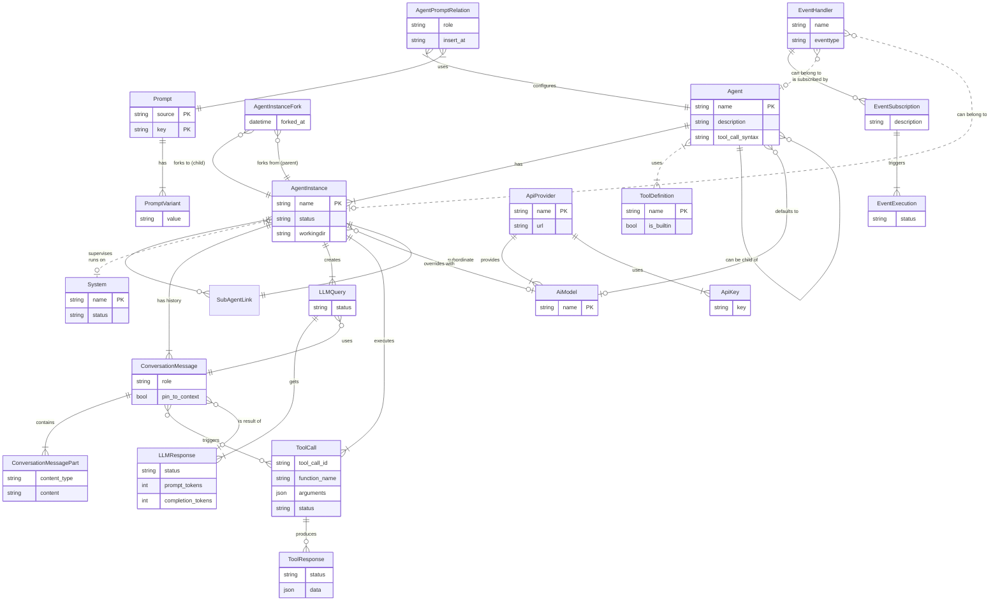

```mermaid
erDiagram
    Agent {
        string name PK
        string description
        string tool_call_syntax
    }
    AgentInstance {
        string name PK
        string status
        string workingdir
    }
    AgentInstanceFork {
        datetime forked_at
    }
    SubAgentLink {
    }
    ConversationMessage {
        string role
        bool pin_to_context
    }
    ConversationMessagePart {
        string content_type
        string content
    }
    LLMQuery {
        string status
    }
    LLMResponse {
        string status
        int prompt_tokens
        int completion_tokens
    }
    ToolCall {
        string tool_call_id
        string function_name
        json arguments
        string status
    }
    ToolResponse {
        string status
        json data
    }
    ToolDefinition {
        string name PK
        bool is_builtin
    }
    ApiProvider {
        string name PK
        string url
    }
    AiModel {
        string name PK
    }
    ApiKey {
        string key
    }
    System {
        string name PK
        string status
    }
    Prompt {
        string source PK
        string key PK
    }
    PromptVariant {
        string value
    }
    AgentPromptRelation {
        string role
        string insert_at
    }
    EventHandler {
        string name
        string eventtype
    }
    EventSubscription {
        string description
    }
    EventExecution {
        string status
    }

    Agent ||--|{ AgentInstance : "has"
    Agent }|..|{ ToolDefinition : "uses"
    Agent ||--o{ Agent : "can be child of"
    AgentInstance ||--o{ SubAgentLink : "supervises"
    SubAgentLink ||--|| AgentInstance : "subordinate"
    AgentInstance }|..o| System : "runs on"
    AgentInstance ||--|{ ConversationMessage : "has history"
    AgentInstance ||--|{ LLMQuery : "creates"
    AgentInstance ||--|{ ToolCall : "executes"
    AgentInstanceFork }o--|| AgentInstance : "forks to (child)"
    AgentInstanceFork }o--|| AgentInstance : "forks from (parent)"

    ConversationMessage ||--|{ ConversationMessagePart : "contains"
    ConversationMessage }o--o{ ToolCall : "triggers"
    ConversationMessage }o--o| LLMResponse : "is result of"

    LLMQuery ||--|{ LLMResponse : "gets"
    LLMQuery }o--|| ConversationMessage : "uses"

    ToolCall ||--o{ ToolResponse : "produces"

    ApiProvider ||--|{ AiModel : "provides"
    ApiProvider ||--|{ ApiKey : "uses"
    Agent }o--o| AiModel : "defaults to"
    AgentInstance }o--o| AiModel : "overrides with"

    Prompt ||--|{ PromptVariant : "has"
    AgentPromptRelation }|--|| Agent : "configures"
    AgentPromptRelation }|--|| Prompt : "uses"

    EventHandler ||--o{ EventSubscription : "is subscribed by"
    EventSubscription ||--|{ EventExecution : "triggers"
    EventHandler }o..o| Agent : "can belong to"
    EventHandler }o..o| AgentInstance : "can belong to"

```