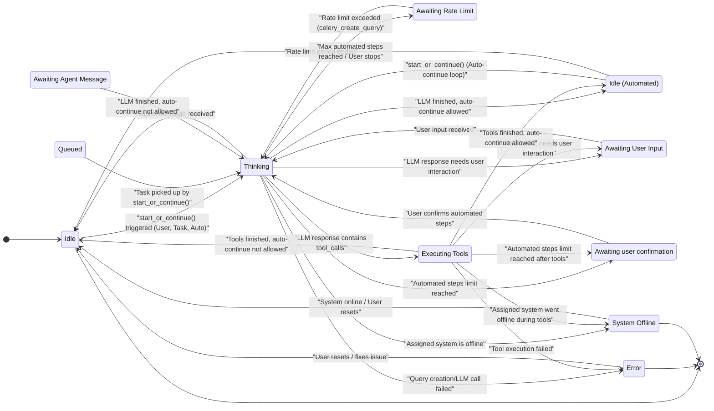

```mermaid
stateDiagram-v2
    direction LR

    [*] --> Idle

    Idle --> Thinking : "start_or_continue() triggered (User, Task, Auto)"
    Queued --> Thinking : "Task picked up by start_or_continue()"
    Idle_Automated --> Thinking : "start_or_continue() (Auto-continue loop)"
    Awaiting_User_Input --> Thinking : "User input received"
    Awaiting_Automation_Confirmation --> Thinking : "User confirms automated steps"
    Awaiting_Agent_Message --> Thinking : "Agent message received"
    Awaiting_Rate_Limit --> Thinking : "Rate limit period ended"

    Thinking --> Executing_Tools : "LLM response contains tool_calls"
    Thinking --> Awaiting_Rate_Limit : "Rate limit exceeded (celery_create_query)"
    Thinking --> Awaiting_User_Input : "LLM response needs user interaction"
    Thinking --> Awaiting_Automation_Confirmation : "Automated steps limit reached"
    Thinking --> Idle_Automated : "LLM finished, auto-continue allowed"
    Thinking --> Idle : "LLM finished, auto-continue not allowed"
    Thinking --> System_Offline : "Assigned system is offline"
    Thinking --> Error : "Query creation/LLM call failed"

    Executing_Tools --> Awaiting_User_Input : "Tool result needs user interaction"
    Executing_Tools --> Awaiting_Automation_Confirmation : "Automated steps limit reached after tools"
    Executing_Tools --> Idle_Automated : "Tools finished, auto-continue allowed"
    Executing_Tools --> Idle : "Tools finished, auto-continue not allowed"
    Executing_Tools --> System_Offline : "Assigned system went offline during tools"
    Executing_Tools --> Error : "Tool execution failed"

    Error --> Idle : "User resets / fixes issue"
    System_Offline --> Idle : "System online / User resets"

    Idle_Automated --> Idle : "Max automated steps reached / User stops"

    Idle --> [*]
    Error --> [*]
    System_Offline --> [*]

    state "Idle" as Idle
    state "Idle (Automated)" as Idle_Automated
    state "Thinking" as Thinking
    state "Executing Tools" as Executing_Tools
    state "Awaiting User Input" as Awaiting_User_Input
    state "Awaiting Agent Message" as Awaiting_Agent_Message
    state "Awaiting Rate Limit" as Awaiting_Rate_Limit
    state "Awaiting user confirmation" as Awaiting_Automation_Confirmation
    state "Queued" as Queued
    state "Error" as Error
    state "System Offline" as System_Offline
```